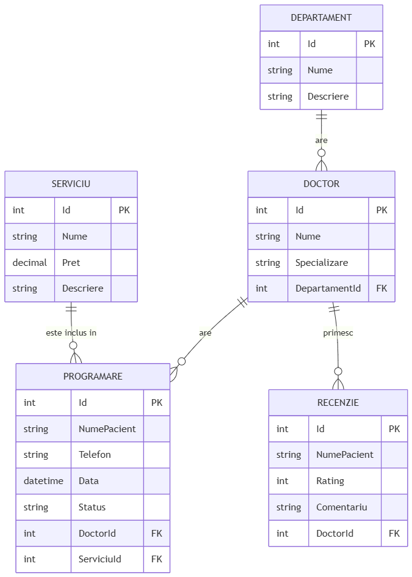

# Ghid laborator – baza de date și Entity Framework (PawSpital)

Ghid foarte scurt, în ordinea în care de obicei întreabă profesoara.

---

## 1. Design-ul bazei de date – diagramă și cerința cu 5–6 tabele (4p)

### Ce trebuie să spui pe scurt

- Am **6 tabele**, **fără** tabele de utilizatori/login în baza de date (autentificarea nu e în scope la cerința asta).
- Tabelele: **Departamente**, **Doctori**, **Servicii**, **Salii**, **Programari**, **Recenzii**.
- Legăturile sunt relații clasice: un departament are mai mulți doctori; un doctor aparține unui departament; programările leagă doctor + serviciu (+ opțional sală); recenziile sunt legate de doctor.

### Diagramă (model relațional) – PNG din proiect

Imaginea de mai jos e fișierul **`diagrama-model-relational.png`** din folderul `docs` (lângă acest ghid). O poți deschide separat sau o arăți profesoarei direct din acest `.md` dacă editorul afișează imaginile.

### Cardinalități și legături – ce vorbești oral (fără termeni complicați)

| Legătură | În cuvinte simple |
|----------|-------------------|
| **Departament ↔ Doctor** | **Un** departament poate avea **mulți** doctori. **Un** doctor aparține **unui singur** departament. (1 la N) |
| **Doctor ↔ Programare** | **Un** doctor poate avea **multe** programări. **O** programare e la **un singur** doctor. (1 la N) |
| **Serviciu ↔ Programare** | **Un** serviciu poate apărea în **multe** programări. **O** programare folosește **un singur** serviciu. (1 la N) |
| **Sală ↔ Programare** | **O** sală poate avea **multe** programări. **O** programare **poate** avea o sală, **sau** poate fi fără sală (câmp opțional). (1 la N, partea de programare e opțională) |
| **Doctor ↔ Recenzie** | **Un** doctor poate primi **multe** recenzii. **O** recenzie e pentru **un singur** doctor. (1 la N) |

Cheile străine (**FK**) sunt coloanele gen `DepartamentId`, `DoctorId`, `ServiciuId`, `SalaId`: arată „cărui rând din alt tabel îi aparține înregistrarea asta”.

---

## 2. Implementarea bazei de date – Code First (2p)

### Ce înseamnă Code First (o frază)

- Nu am desenat mai întâi baza în SQL și apoi gener codul.
- Am scris **mai mult întâi clasele C#** (modelele) și **contextul**; baza de date și tabelele au fost **generate din cod**, cu **migrări EF**.

### Unde sunt în proiect

| Ce | Unde |
|----|------|
| Clasele care devin tabele | folder **`Models/`** – `Departament.cs`, `Doctor.cs`, `Serviciu.cs`, `Sala.cs`, `Programare.cs`, `Recenzie.cs` |
| Legăturile în cod | în fiecare model: proprietăți gen `DepartamentId` + `Departament`, sau colecții gen `ICollection<Doctor>` |
| Contextul (legătura cu EF) | **`Data/SpitalContext.cs`** – liste `DbSet<>` = „ce tabele știe EF despre proiect” |

### Cum arată legăturile în cod (exemple simple)

- **Doctor → Departament:** în `Doctor` există `DepartamentId` (numărul cheii străine) și `Departament` (obiectul legat).
- **Departament → Doctori:** în `Departament` există colecția `Doctori` (lista doctorilor din acel departament).
- **Programare:** are `DoctorId`, `ServiciuId`, opțional `SalaId`, plus proprietățile `Doctor`, `Serviciu`, `Sala`.

EF folosește convențiile astea ca să știe singur ce e relație 1-N și unde pune FK în baza de date.

---

## 3. Conexiunea aplicației web la baza de date – Entity Framework (2p)

### Trei locuri pe care le menționezi

**1) Fișierul `appsettings.json`**

- Aici e **șirul de conexiune**: unde stă baza.
- La noi: **SQLite**, fișier **`PawSpital.db`** lângă proiect (`Data Source=PawSpital.db`). Nu trebuie server separat instalat – „plug and play”.

**2) Înregistrarea serviciului – `Program.cs`**

- **`AddDbContext<SpitalContext>(...)`** înseamnă: „când un controller sau alt cod cere un `SpitalContext`, îi dau una configurată cu SQLite și cu șirul din config”.
- **`UseSqlite(...)`** spune explicit: folosește providerul SQLite pentru această bază.

**3) La pornirea aplicației**

- Se creează un **scope**, se cere `SpitalContext`, și se apelează **`Database.Migrate()`** – adică „aplică migrările pe baza de date” (creează tabelele sau le actualizează dacă modelul s-a schimbat). Detalii la punctul 5.

---

## 4. Testare – controller cu CRUD pe un tabel (1p)

### Ce controller

- **`DepartamenteController.cs`** – lucrează cu entitatea **Departament** → tabelul **`Departamente`** din SQLite.

### Ce înseamnă CRUD (ce face profesoara când testează)

| Literă | Acțiune | Rută tipică | Ce se întâmplă |
|--------|---------|-------------|----------------|
| **C** Create | adăugare | `/Departamente/Create` | formular → `SaveChanges` → INSERT în baza de date |
| **R** Read | citire | `/Departamente` (listă), `/Departamente/Details/5` (un rând) | SELECT din baza de date |
| **U** Update | modificare | `/Departamente/Edit/5` | UPDATE în baza de date |
| **D** Delete | ștergere | `/Departamente/Delete/5` | DELETE din baza de date |

Controllerul primește **`SpitalContext`** prin constructor (**dependency injection**) – adică ASP.NET îi dă deja conexiunea/contextul gata configurat.

Paginile sunt în **`Views/Departamente/`** (formulare + liste).

---

## 5. Migrările – ce sunt și ce fac (întrebarea despre migrations)

### În două propoziții

- **Migrarea** e un **fișier generat** care descrie **ce schimbări** trebuie făcute în baza de date (CREATE TABLE, coloane noi, etc.) ca să se potrivească cu **modelele C#** din momentul acela.
- **`Update-Database`** din Visual Studio sau **`dotnet ef database update`** aplică aceste schimbări în baza reală. La noi, la **run** se mai apelează și **`Migrate()`** din `Program.cs`, ca baza să fie mereu la zi când pornești aplicația.

### Unde le găsești

- Folder **`Migrations/`** – de ex. `..._InitialCreate.cs` creează tabelele inițiale; `SpitalContextModelSnapshot.cs` ține „fotografia” curentă a modelului pentru EF.

### Dacă modifici un model mai târziu

1. `dotnet ef migrations add NumeSchimbare`
2. `dotnet ef database update`  
(sau la run, `Migrate()` aplică automat ce lipsește).

---

## Rezumat în 30 de secunde pentru profesoară

1. **Diagramă:** 6 tabele, relații 1-N între departament–doctor, doctor–programări/recenzii, serviciu–programări, sală–programări (opțional), fără tabele de useri în DB.  
2. **Code First:** modele în `Models`, context în `Data/SpitalContext.cs`.  
3. **Conexiune:** `appsettings.json` + `AddDbContext` + `UseSqlite` în `Program.cs`.  
4. **Test:** `DepartamenteController` – CRUD pe tabelul Departamente.  
5. **Migrări:** fișiere în `Migrations/` care transformă modelul în schema bazei; aplicate cu update la DB sau `Migrate()` la start.

---

*Proiect: PawSpital – SQLite (`PawSpital.db`), Entity Framework Core.*
