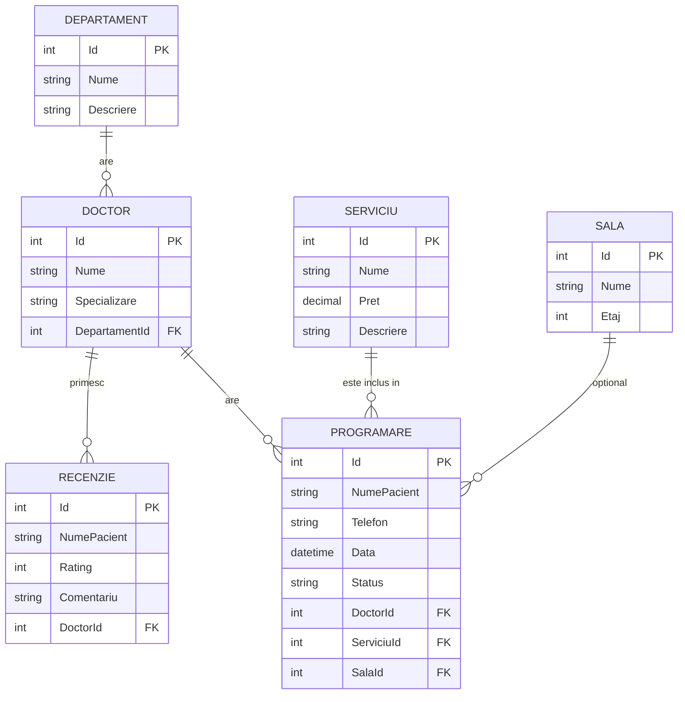

# Raport Proiect - PawSpital

Acest document descrie modul în care au fost îndeplinite cerințele pentru proiect:

## 1. Design-ul bazei de date (diagrama modelului relational) - 4p
Baza de date a fost proiectată cu **6 tabele** (fără tabele de utilizatori/autentificare), interconectate pentru logica unui spital: departamente, doctori, săli de consultație, servicii medicale, programări și recenzii.

### Diagrama modelului relațional:

## 2. Implementarea bazei de date (abordare code first) - 2p
Baza de date a fost generată 100% folosind abordarea **Code First**.
- **Modelele** se află în folderul `Models/`: `Departament.cs`, `Doctor.cs`, `Serviciu.cs`, `Sala.cs`, `Programare.cs`, `Recenzie.cs`.
- **Configurarea relațiilor și maparea DbSet** s-a făcut folosind clasa izolată de DbContext: `Data/SpitalContext.cs`.
- Modelul a fost transformat în scripturi și trimis în DB local cu ajutorul uneltelor `dotnet ef`. Migrarea se află generată (automat) în proiect, direct prin comanda `Update-Database`.

## 3. Crearea conexiunii dintre aplicatia web si baza de date (Entity Framework) - 2p
- Configurarea folosește provider-ul **SQLite** (`Microsoft.EntityFrameworkCore.Sqlite`): fișier unic `PawSpital.db`, fără server de instalat — conexiunea este în `appsettings.json`, cheia `ConnectionStrings:DefaultConnection` (ex.: `Data Source=PawSpital.db`).
- Serviciul este înregistrat în `Program.cs` prin `builder.Services.AddDbContext<SpitalContext>(options => options.UseSqlite(...))`.

## 4. Testarea conexiunii folosind un Controller de entitate (CRUD) - 1p
Am automatizat cu ajutorul Scaffolding-ului un set de View-uri strict pentru testarea acestor tipuri de date în mod grafic (`Views/Departamente/*`).
Pentru a demonstra funcționalitatea bazei de date, s-a implementat complet un Controller denumit `DepartamenteController.cs` (folderul `Controllers/`), care furnizează următoarele rute HTTP pentru lucrul cu DB-ul:
- **CREATE**: Ruta `/Departamente/Create` – Adaugă un departament nou care persistă în `PawSpital.db`.
- **READ**: Ruta `/Departamente` (Index) obține din baza de date lista generată a departamentelor, iar ruta `/Departamente/Details/{id}` afișează detaliile izolate per entitate.
- **UPDATE**: Ruta `/Departamente/Edit/{id}` – Rescrie câmpurile modificate la pasul anterior.
- **DELETE**: Ruta `/Departamente/Delete/{id}` – Șterge intrarea asociată din DB și din memorie.

Pentru evaluare rapidă, link-ul pentru testare persistă pe antetul din fișierul de bază al afișajului, accesibil pe pagina **Acasă -> Departamente (Test DB/CRUD)**.
